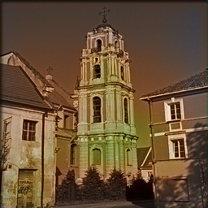
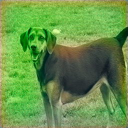
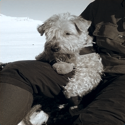

# colorization_pix2pix

* pix2pix 모델을 사용해서 image colorization을 구현한다.
* color space, Loss ftn의 변화하면서 최적 모델을 찾는다.

* [pix2pix](https://phillipi.github.io/pix2pix/) 논문을 참고하여 작성.
***
* 가장 기본적인 모델 구현(LAB color space + cGAN + L1)

| epoch | bw | output | groud-truth|
|:---:|:---:|:---:|:---:|
| 1 |  |  |  |
| 2 |  |  |  |
| 5 |  |  |  |
| 10 |  |  |  |

* 외외로 잘 된다. 

***

## color space 에 따른 학습 경향

| epoch | BW/out/ground-truth |
|:---:|:---:|
| 1 |  |
| 2 |  |
| 3 |  |

* lab color space보다 약간 채도가 낮은 것을 볼 수 있다. RGB의 경우 채널이 3개이기에 학습해야 하는 양이 많기에 속도가 느린것 같다. LAB의 경우 A채널과 B채널만 학습하면 된다.

***

## Loss ftn 구성에 따른 학습.

* cGAN loss only

| epoch | bw | output | groud-truth|
|:---:|:---:|:---:|:---:|
| 1 |  |  |  |
| 2 |  |  |  |
| 5 |  |  |  |
| 10 |  |  |  |

* L1 loss only

| epoch | bw | output | groud-truth|
|:---:|:---:|:---:|:---:|
| 1 |  |  |  |
| 2 |  |  |  |
| 5 |  |  |  |
| 10 |  |  |  |

* cGAN은 타겟이 아니라도 특정한 색을 내는데에 큰 영향을 준다.(색의 다양성 및 채도가 높은 이미지)
* L1항은 Ground truth의 평균적인 색을 따라가기에, 평균적인 회색조, 채도가 낮은 이미지가 생성되었다.
* 두 Loss함수를 모두 사용하게 되면 두 함수의 특성을 모두 얻어 가장 좋은 결과를 얻을 수 있었다.